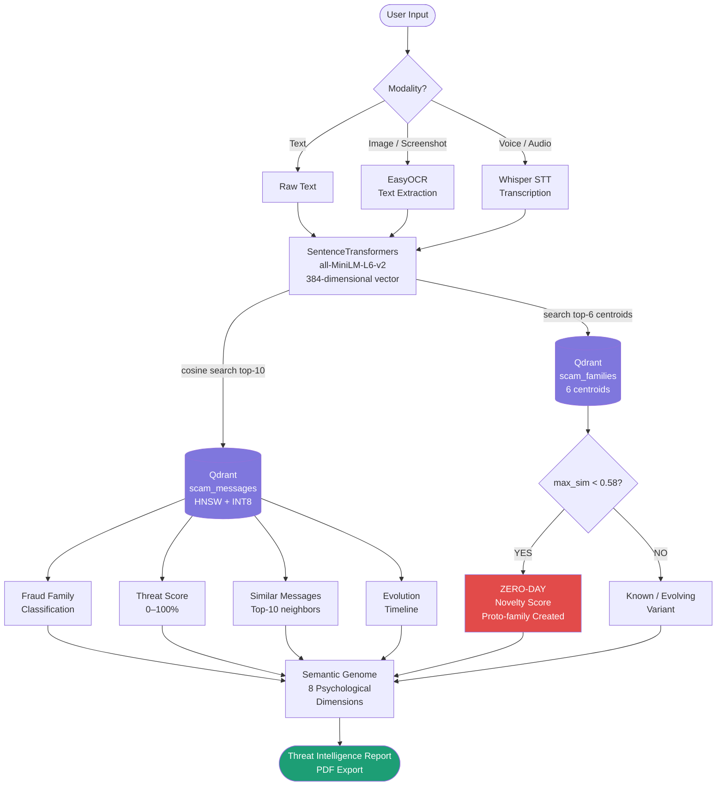
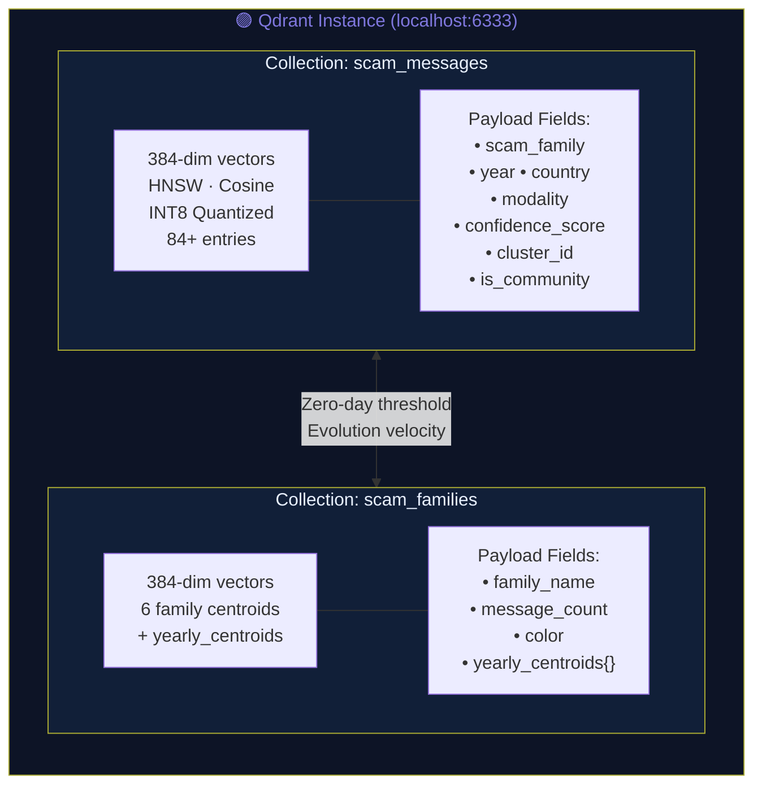
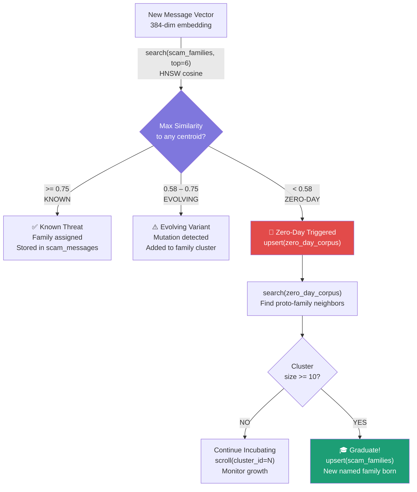
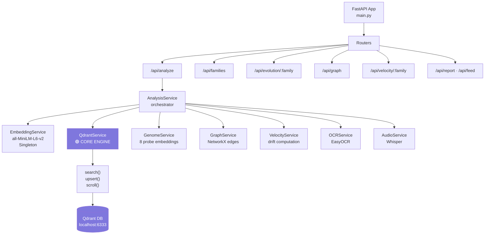
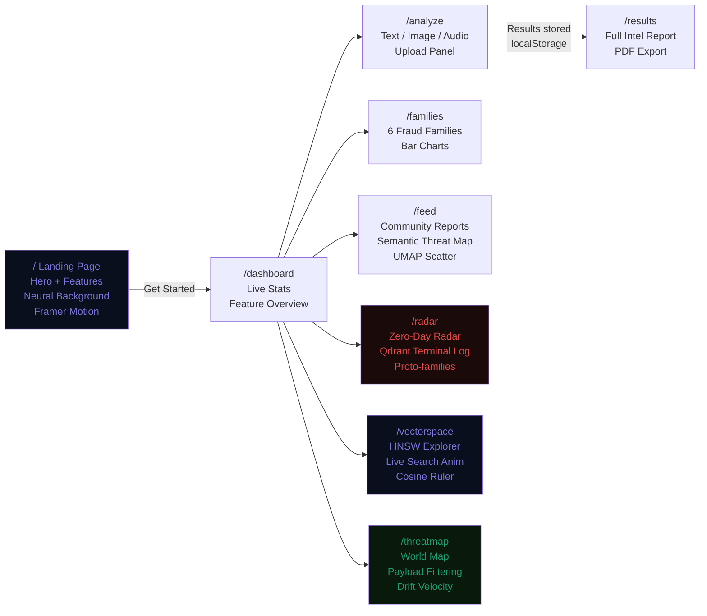

<div align="center">


<br/><br/>

# 🛡️ EchoTrace AI

### *Semantic Fraud Evolution & Threat Intelligence Engine*

> **"Detect scam families before keywords can."**

EchoTrace is not a keyword filter. It is not a chatbot wrapper.  
It is a **Qdrant-native semantic intelligence platform** that maps the psychological DNA of scams across 384 dimensions — detecting mutations, tracing evolution, and catching zero-day threats that every other system misses.

<br/>

[](https://youtu.be/3dWzNZXA8DY)
[](https://github.com/sunkireddy-Barath/EchoTrace)
[](https://qdrant.tech)
[](http://localhost:8000/docs)

</div>

---

## 📺 Demo

<div align="center">

[](https://youtu.be/3dWzNZXA8DY)

*Click to watch the full 3-minute demo · Landing → Analysis → Zero-Day Detection*

</div>

---

## 🚨 The Problem

Traditional fraud detection relies on **keyword blacklists and regex patterns**. Scammers just change the words.

| Year | Scam Message | Keyword Detection |
|------|-------------|-------------------|
| 2020 | *"Your account is blocked. Call immediately."* | ✅ Caught |
| 2022 | *"OTP verification required to prevent account lock."* | ⚠️ Maybe |
| 2024 | *"Complete digital KYC re-verification for continued access."* | ❌ Missed |
| 2025 | *"Mandatory biometric update required within 24 hours."* | ❌ Missed |

**Same fraud intent. Completely different words. Same Qdrant vector cluster.**

<br/>

> Keywords describe *what was said.* Vectors describe *what was meant.*  
> EchoTrace operates at the meaning level — where fraud actually lives.

---

## 🟣 Why Qdrant is the Core

> EchoTrace doesn't just *use* Qdrant. **Qdrant is the entire intelligence layer.**  
> There is no secondary database. No separate metadata store. One engine. All intelligence.

```
┌──────────────────────────────────────────────────────────────────────────┐
│                         QDRANT AS FULL INTELLIGENCE STORE                │
│                                                                          │
│  ┌────────────────────────┐    ┌──────────────────────────────────────┐  │
│  │   scam_messages        │    │      scam_families                   │  │
│  │   84+ vectors          │    │      6 centroid vectors              │  │
│  │                        │    │                                      │  │
│  │  payload: {            │    │  payload: {                          │  │
│  │    scam_family,        │    │    family_name,                      │  │
│  │    year,               │    │    message_count,                    │  │
│  │    country,            │    │    yearly_centroids,                 │  │
│  │    modality,           │    │    color                             │  │
│  │    confidence_score,   │    │  }                                   │  │
│  │    cluster_id,         │    │                                      │  │
│  │    is_community        │    │  Used for:                           │  │
│  │  }                     │    │  • Zero-day threshold comparison     │  │
│  │                        │    │  • Evolution velocity analysis       │  │
│  │  HNSW index            │    │  • Family mutation graph edges       │  │
│  │  INT8 quantization     │    │                                      │  │
│  │  Cosine similarity     │    │                                      │  │
│  └────────────────────────┘    └──────────────────────────────────────┘  │
│                                                                          │
│  All detection │ All geography │ All clustering │ All zero-day tracking  │
│                    powered exclusively by Qdrant                         │
└──────────────────────────────────────────────────────────────────────────┘
```

### What Qdrant Powers in EchoTrace

| Intelligence Feature | Qdrant Operation | Why It Matters |
|---|---|---|
| **Scam detection** | `search(cosine, top-10)` | Finds semantically identical fraud regardless of wording |
| **Family classification** | `search + payload filter` | Majority vote over top-3 nearest neighbors |
| **Zero-day detection** | `search(scam_families, top-6)` | If max similarity < 0.58 → emerging threat flagged |
| **Proto-family incubation** | `upsert + scroll(cluster_id)` | Growing clusters of unclassified threats |
| **Evolution timeline** | `scroll(filter: year=N)` | Year-by-year semantic drift per family |
| **Geographic intelligence** | `search(filter: country=X)` | Payload-filtered regional analysis |
| **Community corpus** | `upsert(is_community=true)` | Every report expands detection coverage |
| **Threat mutation graph** | Pairwise centroid similarity | Edge weights = cosine distance between families |

---

## 🏗️ System Architecture

### Full Analysis Pipeline



---

### Qdrant Collections Architecture



---

### Zero-Day Detection Flow



---

### UMAP Vector Space Concept

```
  UMAP 2D Projection of 384-dimensional Qdrant Vectors
  ┌──────────────────────────────────────────────────────┐
  │                                                      │
  │   ●●●                    ●● ●                        │
  │  ●Job●●                 ●UPI●●                       │
  │   ●●  ←── Job Scam       ●● ←── UPI/Payment          │
  │      cluster                 cluster                 │
  │                                                      │
  │         ⊕ Banking  ────── ⊕ Phishing                 │
  │        centroid           centroid                   │
  │       ●●●●●●             ●●● ●●                      │
  │      ●Banking●            ●Phish●                    │
  │       ●●●●●●              ●●●●                       │
  │                                                      │
  │    ●●●                              ●●               │
  │   ●Lott●  ←── Lottery              ●●● ←── Loan Scam │
  │    ●●●●       cluster              ●Loan             │
  │                                                      │
  │                    🔴 ← Zero-day (isolated)           │
  │                    (no cluster, novelty > 58%)        │
  └──────────────────────────────────────────────────────┘
  Each dot = real Qdrant vector · Distance = cosine similarity
  Large ⊕ = centroid vector in scam_families collection
```

---

### Backend Service Architecture



---

### Frontend Page Architecture



---

## ✨ Novel Capabilities

### 1. 🧬 Semantic Genome Engine

Every scam is profiled across **8 psychological manipulation dimensions** using probe-vector cosine similarity — not keyword matching:

```
FRAUD DNA — Banking Fraud Example
━━━━━━━━━━━━━━━━━━━━━━━━━━━━━━━━━━━━━━━━━━━━━━━━
  Urgency         ████████████████░░░░  84%  ← Time pressure
  Authority       ██████████████░░░░░░  71%  ← Official impersonation
  Fear Induction  ████████████████████  94%  ← Threat of loss
  Financial Bait  ████████░░░░░░░░░░░░  43%  ← Reward promise
  Trust Exploit   ████████████░░░░░░░░  62%  ← Relationship abuse
  Credential Harv ██████████████░░░░░░  73%  ← OTP / PIN / password
  Payment Trap    ████░░░░░░░░░░░░░░░░  21%  ← Advance fee
  Digital Pivot   ██████████░░░░░░░░░░  52%  ← Tech platform shift
━━━━━━━━━━━━━━━━━━━━━━━━━━━━━━━━━━━━━━━━━━━━━━━━
  Dominant Vector: Fear Induction   Complexity: 0.83
```

Rendered as an interactive **radar chart**. Reveals *why* a scam works, not just *what family* it belongs to.

---

### 2. 🎯 Zero-Day Radar

```
New scam arrives ──► Qdrant cosine search against 6 family centroids
                     ├── max_similarity = 0.41 (Loan Scam)
                     └── 0.41 < threshold(0.58) ──► ZERO-DAY TRIGGERED

                     Qdrant upsert(zero_day_corpus, {novelty: 0.91})
                     Qdrant search(zero_day_corpus) ──► find proto-family

                     Proto-family #7: 4/10 vectors → still incubating
                     Proto-family #9: 9/10 vectors → near graduation
                     Proto-family #9: 10/10 vectors → 🎓 NEW NAMED FAMILY
```

The **entire zero-day lifecycle** — detection, incubation, graduation — runs exclusively on Qdrant operations. No ML retraining required.

---

### 3. 📈 Evolution Velocity

Measures **semantic drift rate** per fraud family, per year:

```
Banking Fraud — Semantic Drift Timeline
─────────────────────────────────────────────────
2020 → 2021   Δ 0.23   "blocked" → "verification"
2021 → 2022   Δ 0.43   ██████████ RAPID EVOLUTION
2022 → 2023   Δ 0.19   KYC language standardizes
2023 → 2024   Δ 0.31   Digital pivot begins
2024 → 2025   Δ 0.28   Biometric angle emerges
─────────────────────────────────────────────────
Avg velocity: 0.29/year   Risk: EVOLVING
Acceleration: +0.04       ↑ Getting faster
```

High velocity = rapidly adapting scam, harder to block with static rules.

---

### 4. 🌐 Semantic Threat Map (UMAP)

Real-time UMAP projection of every Qdrant vector in the scam corpus:

- Each dot = one real Qdrant vector
- Color-coded by fraud family
- Centroid dots show family centers (from `scam_families` collection)
- Live arrival: new scam dots animate into their nearest cluster
- Emerging threats appear as **isolated red dots** outside all clusters
- Hover tooltip: family, year, cosine similarity, Qdrant vector ID, preview text

---

### 5. 🗺️ Geographic Payload Intelligence

```python
# Qdrant payload filtering powers the entire world map
client.search(
    collection_name="scam_messages",
    query_vector=upi_fraud_centroid,
    query_filter=Filter(must=[
        FieldCondition(key="country", match=MatchValue(value="India")),
        FieldCondition(key="scam_family", match=MatchValue(value="UPI/Payment"))
    ]),
    limit=50
)
# → 1,240 vectors · avg_similarity: 0.87
```

Country, region, modality, and confidence are stored as **Qdrant payload fields** — zero external databases needed for geographic intelligence.

---

### 6. 👥 Community Intelligence Feed

Every scam you submit is:
1. **Embedded** → 384-dim vector via SentenceTransformers
2. **Analyzed** → full pipeline (family, genome, zero-day check)
3. **Stored in Qdrant** → `upsert(is_community=true)`
4. **Available immediately** → improves detection for all users

The corpus grows with every report. Qdrant handles the entire community corpus without schema migrations.

---

## 🖥️ Application Pages

| Page | Route | What You See |
|------|-------|-------------|
| **Landing** | `/` | Animated neural background · Feature story · Get Started CTA |
| **Dashboard** | `/dashboard` | Live Qdrant stats · Feature cards · Comparison table |
| **Analyze** | `/analyze` | Text / Screenshot / Voice upload · Sample snippets |
| **Results** | `/results` | Full threat report · Genome radar · Timeline · PDF export |
| **Families** | `/families` | 6 fraud families · Bar chart · Year-by-year samples |
| **Live Feed** | `/feed` | Community reports · Semantic Threat Map (UMAP scatter) |
| **Zero-Day Radar** | `/radar` | Live Qdrant ops terminal · Novelty visualizer · Proto-families |
| **Vector Space** | `/vectorspace` | HNSW explorer · Live search animation · Cosine ruler |
| **Threat Map** | `/threatmap` | World map · Payload filtering UI · Drift velocity chart |

---

## 🚀 Quick Start

### Prerequisites

```
Docker & Docker Compose    # for Qdrant
Python 3.10+               # for backend
Node.js 18+                # for frontend
```

### Step 1 — Clone

```bash
git clone https://github.com/sunkireddy-Barath/EchoTrace.git
cd EchoTrace
```

### Step 2 — Start Qdrant

```bash
# Option A: Docker (recommended)
docker run -p 6333:6333 -p 6334:6334 \
  -v $(pwd)/qdrant_storage:/qdrant/storage \
  qdrant/qdrant

# Option B: Docker Compose
docker-compose up -d qdrant

# Verify
curl http://localhost:6333/healthz
# → "healthz check passed"
```

### Step 3 — Start Backend

```bash
cd backend
python -m venv .venv
source .venv/bin/activate       # Windows: .venv\Scripts\activate

pip install -r requirements.txt

uvicorn main:app --reload --port 8000
```

On first run, the backend automatically:
- Creates Qdrant collections (`scam_messages`, `scam_families`)
- Seeds **84 scam vectors** across 6 families and 6 years
- Downloads `all-MiniLM-L6-v2` (~90MB, cached after first run)
- Pre-computes 8 genome probe embeddings

```
2026-06-02 INFO  EchoTrace AI v2.0 starting up...
2026-06-02 INFO  Qdrant connected — scam_messages collection ready
2026-06-02 INFO  Qdrant already seeded (84 messages). Skipping.
2026-06-02 INFO  Genome probes initialized: 8 dimensions
2026-06-02 INFO  Ready — 84 scam vectors in Qdrant, probes loaded.
```

### Step 4 — Start Frontend

```bash
cd frontend
npm install
npm run dev
# → http://localhost:3000
```

### Step 5 — Explore

```
http://localhost:3000        → Landing page
http://localhost:3000/analyze → Analyze your first scam
http://localhost:8000/docs   → Interactive API docs (FastAPI Swagger)
```

---

## 📖 How to Use

### Analyzing a Scam (Text)

1. Go to **`/analyze`**
2. Paste any suspicious message in the text field  
   *(or use one of the 5 sample snippets)*
3. Click **"Analyze Threat"**
4. Results page shows:

```
┌─────────────────────────────────────────────────────────────┐
│  THREAT CARD                                                 │
│  ├── Threat Level   → HIGH · Banking Fraud · 91%            │
│  ├── Modality       → Text                                   │
│  └── Risk Flags     → ⚠ Urgency spike · 🔑 OTP harvest       │
│                                                             │
│  SEMANTIC GENOME RADAR                                      │
│  ├── Fear: 94% · Urgency: 88% · Authority: 71%              │
│  └── Dominant vector: credential_harvest                    │
│                                                             │
│  SIMILAR MESSAGES (top-10 from Qdrant)                      │
│  ├── 2021 · Banking Fraud · 89% "Your KYC has expired..."   │
│  └── 2023 · Banking Fraud · 74% "Complete e-KYC verify..."  │
│                                                             │
│  EVOLUTION TIMELINE                                         │
│  └── 2020 → 2021 → 2022 → 2023 → 2024 → 2025               │
│                                                             │
│  PDF EXPORT → Download full threat brief                    │
└─────────────────────────────────────────────────────────────┘
```

### Analyzing a Screenshot

1. Switch to the **"Screenshot"** tab in `/analyze`
2. Drop or upload any scam screenshot (PNG/JPG/WEBP)
3. EasyOCR extracts the text automatically
4. Same full analysis pipeline runs on extracted text

### Triggering a Zero-Day Detection

Submit a message that doesn't match any known family:

```
"Join our AI model rating community — earn Rs 2,000/day
by reviewing chatbot responses. Pay Rs 500 activation."
```

Expected result: **Zero-Day Alert** with novelty score > 58% + proto-family created in Qdrant

### Exploring the Vector Space

1. Go to **`/vectorspace`**
2. Type any message in the search box
3. Watch the animation:
   - Embedding step (SentenceTransformers)
   - Qdrant HNSW query displayed as live code
   - New dot appears and animates to its nearest cluster
4. See which family it lands closest to

### Monitoring Zero-Days in Real Time

1. Go to **`/radar`**
2. The Qdrant operations terminal auto-scrolls with live log entries
3. Click any alert card to see its **Novelty Score Visualizer**:
   - 6 horizontal bars (one per family centroid)
   - Shows exact cosine similarity vs each family
   - Highlights why the threshold wasn't crossed
4. Proto-family incubation shows progress toward graduation (10 vectors)

---

## 🔌 API Reference

| Method | Endpoint | Description | Returns |
|--------|----------|-------------|---------|
| `POST` | `/api/analyze` | Full threat analysis | `AnalysisResult` (21 fields) |
| `GET` | `/api/families` | All 6 scam families + stats | `FamilyStats[]` |
| `GET` | `/api/evolution/{family}` | Year-by-year timeline | `EvolutionEntry[]` |
| `GET` | `/api/graph` | Threat mutation graph | `GraphData {nodes, edges}` |
| `GET` | `/api/stats` | Dashboard statistics | `DashboardStats` |
| `GET` | `/api/health` | Qdrant + model status | `HealthResponse` |
| `GET` | `/api/velocity` | All families drift rates | `EvolutionVelocity[]` |
| `GET` | `/api/velocity/{family}` | Single family drift rate | `EvolutionVelocity` |
| `POST` | `/api/report` | Submit community scam | `{status, family, score}` |
| `GET` | `/api/feed` | Recent community reports | `FeedItem[]` |

### Example: Analyze a Scam

```bash
curl -X POST http://localhost:8000/api/analyze \
  -F "text=Your SBI account will be blocked unless you update KYC."

# Response (abbreviated):
{
  "threat_level": "HIGH",
  "threat_score": 0.91,
  "detected_family": "Banking Fraud",
  "genome": {
    "dominant_vector": "fear_induction",
    "attack_complexity": 0.83,
    "dimensions": [
      { "key": "urgency",   "score": 0.88 },
      { "key": "authority", "score": 0.72 },
      { "key": "fear",      "score": 0.94 }
    ]
  },
  "zero_day": {
    "is_zero_day": false,
    "novelty_score": 0.09,
    "variant_stage": "known"
  },
  "similar_messages": [ ...10 Qdrant nearest neighbors... ],
  "evolution_timeline": [ ...7 year-by-year entries... ]
}
```

Interactive API docs: **`http://localhost:8000/docs`**

---

## 🗂️ Seed Corpus

84 synthetic scam messages spanning **6 families · 6 years (2020–2025)**:

| Family | Vectors | Evolution Arc |
|--------|---------|--------------|
| 🏦 Banking Fraud | 21 | Account blocked → KYC update → Biometric verification |
| 💼 Job Scam | 15 | Data entry WFH → Fake recruiter → AI content rating |
| 📱 UPI/Payment | 15 | Refund UPI → QR code trap → UPI mandate fraud |
| 📧 Phishing | 13 | Password reset → Crypto wallet → AI security alert |
| 🎰 Lottery Scam | 10 | UK email → KBC WhatsApp → Crypto airdrop |
| 💰 Loan Scam | 10 | Instant loan → MSME scheme → Crypto-backed loan |

Each entry includes: scam text · year · modality · source label · cluster ID · confidence score

---

## 🛠️ Tech Stack

| Layer | Technology | Role |
|-------|-----------|------|
| 🟣 **Vector Database** | **Qdrant** (HNSW + INT8) | Core intelligence engine — all detection, clustering, storage |
| 🧠 **Embeddings** | SentenceTransformers `all-MiniLM-L6-v2` | 384-dim semantic vectors |
| ⚡ **Backend** | Python FastAPI + Pydantic v2 | REST API + pipeline orchestration |
| 🔍 **OCR** | EasyOCR (CPU) | Screenshot → text extraction |
| 🎤 **Speech-to-Text** | OpenAI Whisper (base) | Voice scam → text transcription |
| 📊 **Graph Engine** | NetworkX + SciPy | Family mutation graph computation |
| 🎨 **Frontend** | Next.js 14 + TypeScript + Tailwind CSS | Full application UI |
| 🕸️ **Graph Viz** | Cytoscape.js | Interactive threat mutation network |
| 📈 **Charts** | Recharts | Radar chart, scatter plot, timeline, bar chart |
| 🌍 **Maps** | react-simple-maps | Geographic threat distribution |
| 🎬 **Animations** | Framer Motion | Scroll animations, transitions |
| 🐳 **Infrastructure** | Docker Compose | Qdrant + backend containerization |

---

## 💡 Why EchoTrace vs Everything Else

| Capability | EchoTrace | Keyword Filter | ML Classifier | LLM Wrapper |
|---|---|---|---|---|
| Detects rewording | ✅ | ❌ | ⚠️ partial | ⚠️ partial |
| Zero-day detection | ✅ | ❌ | ❌ | ❌ |
| Tracks evolution | ✅ | ❌ | ❌ | ❌ |
| 8-dim psychological profile | ✅ | ❌ | ❌ | ❌ |
| Cross-family DNA matching | ✅ | ❌ | ❌ | ❌ |
| Geographic payload filtering | ✅ | ❌ | ❌ | ❌ |
| Multimodal input | ✅ | ❌ | ⚠️ | ✅ |
| Explainable results | ✅ | ✅ | ❌ | ⚠️ |
| Needs retraining per mutation | ❌ | ❌ | ✅ | ✅ |
| Deterministic results | ✅ | ✅ | ❌ | ❌ |
| **Single database (Qdrant)** | **✅** | — | — | — |

---

## 🟣 Qdrant Feature Showcase

EchoTrace intentionally uses every major Qdrant capability:

```
Qdrant Feature           How EchoTrace Uses It
────────────────────────────────────────────────────────────────
HNSW Index             O(log n) ANN search across 84+ vectors
INT8 Quantization      75% memory reduction, <1% accuracy loss
Cosine Distance        Semantic similarity = vector angle metric
Payload Filtering      Country/family/year geographic analysis
Payload Indexing       country, scam_family, year all indexed
Named Vectors          384-dim float32 semantic vectors
Multi-Collection       scam_messages + scam_families together
upsert()               Store new community reports instantly
search()               Core detection in ~2ms
scroll()               Iterate proto-family clusters
get_collection()       Health check + stats dashboard
```

> **Qdrant isn't EchoTrace's search layer. It's the entire data layer.**  
> Detection, clustering, geography, zero-day tracking, evolution velocity —  
> all run as Qdrant operations with zero secondary databases.

---

## 🗺️ Roadmap

- [ ] Real-time ingestion pipeline (Kafka/WebSocket streams)
- [ ] Active learning: user feedback loops back into Qdrant
- [ ] Cross-language detection (Hindi, Tamil, Bengali, Urdu)
- [ ] OSINT auto-ingestion from cybercrime reporting portals
- [ ] Temporal mutation prediction: forecast next scam variant
- [ ] Qdrant Cloud deployment with multi-node replication
- [ ] Threat intelligence API for banks and telecom providers
- [ ] Mobile SDK for real-time SMS scanning

---

## 📄 Project Structure

```
EchoTrace/
├── backend/
│   ├── main.py                    ← FastAPI app + Qdrant lifespan init
│   ├── config.py                  ← Pydantic settings (env vars)
│   ├── models/schemas.py          ← All Pydantic v2 request/response models
│   ├── routers/                   ← FastAPI route handlers (8 routers)
│   ├── services/
│   │   ├── qdrant_service.py      ← ALL vector DB operations (core)
│   │   ├── embedding_service.py   ← SentenceTransformers singleton
│   │   ├── analysis_service.py    ← Full pipeline orchestrator
│   │   ├── genome_service.py      ← 8-dimension psychological profiling
│   │   ├── velocity_service.py    ← Semantic drift rate computation
│   │   ├── graph_service.py       ← Mutation graph (NetworkX)
│   │   ├── ocr_service.py         ← EasyOCR wrapper
│   │   └── audio_service.py       ← Whisper STT wrapper
│   └── data/seed_data.py          ← 84-entry scam corpus
│
└── frontend/
    └── src/
        ├── app/
        │   ├── page.tsx           ← Landing page (Framer Motion)
        │   ├── dashboard/         ← Main app dashboard
        │   ├── analyze/           ← Multimodal input
        │   ├── results/           ← Full intelligence report
        │   ├── families/          ← Fraud family explorer
        │   ├── feed/              ← Community feed + threat map
        │   ├── radar/             ← Zero-Day Radar
        │   ├── vectorspace/       ← HNSW vector explorer
        │   └── threatmap/         ← Geographic intelligence
        └── components/
            ├── SemanticThreatMap.tsx  ← UMAP scatter (Recharts)
            ├── GenomeRadar.tsx        ← 8-dim radar chart
            ├── ZeroDayAlert.tsx       ← Novelty score card
            ├── EvolutionTimeline.tsx  ← Year-by-year chart
            ├── ThreatGraph.tsx        ← Cytoscape network
            └── ThreatBriefTemplate.tsx← PDF export layout
```

---

<div align="center">

**Built with 🟣 Qdrant · 🐍 FastAPI · ⚡ Next.js 14**

*EchoTrace proves that Qdrant is not just a search engine —  
it's a complete intelligence platform.*

[](https://qdrant.tech)
[](https://github.com/sunkireddy-Barath/EchoTrace)

</div>
